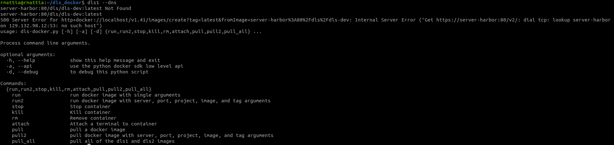
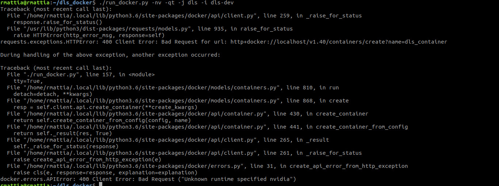
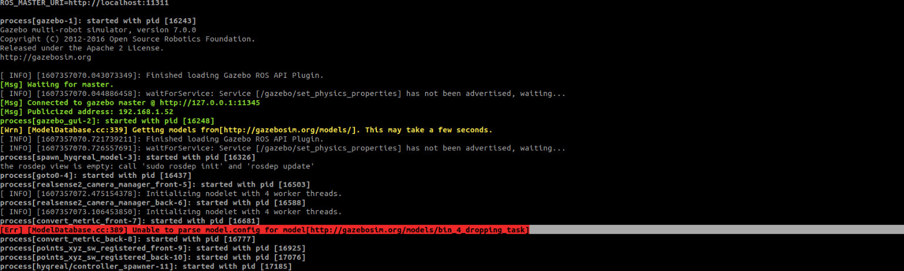

[Go Back Home](Home)

Docker Wiki
================================================================================

This section of the wiki gives information on how to use the docker.

1. [Docker Install](#docker_install)

2. [Common Docker Install Issues](#docker_issues)

3. [Committing a docker image (Making changes permanent)](#docker_commit)

   

Docker Install
--------------------------------------------------------------------------------
<a name="docker_install"></a>
Instructions:
- Make sure you have:
  - configured Git and SSH key
  - [configured the NVIDIA drivers](https://gitlab.advr.iit.it/dls-lab/new-wiki/-/wikis/software/new_pc_with_Ubuntu_20_04_3/new_pc_with_Ubuntu_20_04_3#installing-nvidia-drivers).

Then you can run:
```
$ sudo apt install mesa-utils
$ glxinfo | grep NVIDIA
```
- Clone in the $HOME folder (that is "home/USERNAME") the [dls_docker](https://gitlab.advr.iit.it/dls-lab/dls_docker) repository:
```
$ git clone git@gitlab.advr.iit.it:dls-lab/dls_docker.git -b user
```
- Clone in the home folder the [installation_tools](https://gitlab.advr.iit.it/dls-lab/installation_tools) repository and run the script [install_docker.sh](https://gitlab.advr.iit.it/dls-lab/installation_tools/-/blob/master/install_docker.sh):
```
$ git clone git@gitlab.advr.iit.it:dls-lab/installation_tools.git
$ ./installation_tools/install_docker.sh
```
- You can now restart the PC so that all changes made can be applied.
- When the PC has restarted, open the `/etc/hosts` file with permissions from the home folder:
```
$ sudo gedit /etc/hosts 
```
and add the following line:
```
127.0.0.1	docker
```
- Before pulling the DLS docker images you have to download some dependencies:
```
$ pip3 install python-networkmanager argcomplete argparse docker dockerpty
$ sudo apt install python3-argcomplete
```
- Now you can go inside `dls_docker` repository and pull all the DLS docker images (remove the `-nv` flag if you are not using the NVIDIA drivers):
```
$ python3 dls-docker.py pull_all -nv
```
- You can now configure your PC for using [DLS1 and DLS2 docker images](https://gitlab.advr.iit.it/dls-lab/dls_docker/tree/user).

Docker Issues
--------------------------------------------------------------------------------
<a name="docker_issues"></a>
- When installing docker using ./installation_tools/install_docker.sh you may have a pip3 syntax error. 

You could try to solve it in this way:

```
curl https://bootstrap.pypa.io/pip/3.5/get-pip.py -o get-pip.py
python3 get-pip.py
rm get-pip.py
```

- Nvidia error: could not select device driver “” with capabilities:

You can solve this way:

```
sudo apt install -y nvidia-docker2
sudo systemctl daemon-reload
sudo systemctl restart docker
```

- If the docker installer retrieved using wget produces the following error
```
./install_docker.sh: line 1: syntax error near unexpected token 'newline'
./install_docker.sh: line 1: `<!DOCTYPE html>'
```
then clone [installation tools](https://gitlab.advr.iit.it/dls-lab/installation_tools) manually instead and run the 'install_docker.sh' script inside it.
- You may need the '-api' option in dls-docker.py
- If you do not have nvidia drivers installed, then make sure you are not using the `-nv` option when launching `dls-docker.py`. You may get a message in the terminal that looks like






- `dls_bashrc.sh` file breaks the terminal. If it happens, you will get a message as follows in your terminal every time `bashrc` script gets executed: 


To fix it, replace the [line of `dls_bashrc.sh`](https://gitlab.advr.iit.it/dls-lab/dls_core/blob/master/scripts/dls_bashrc.sh#L41) (branch `master` of [dls_distro](https://gitlab.advr.iit.it/dls-lab/dls-distro)) with the following piece of code:

```
parse_git_branch() {
     git branch 2> /dev/null | sed -e '/^[^*]/d' -e 's/* \(.*\)/ (\1)/'
}

# Add git branch to the terminal prompt
PS1="\[\e]0;\u@\h: \w\a\]${debian_chroot:+($debian_chroot)}\[\033[01;37m\]\u\[\033[00m\]@\[\033[01;32m\]\h\[\033[00m\]:\[\033[01;34m\]\w\[\033[00m\]\[\033[01;93m\]\$(parse_git_branch)\[\033[00m\]\$"
```

Otherwise, if you are not on `master` branch of dls_distro you should not get this error.

- If you are getting the error `[Err] [WindowManager.cc:121] Unable to create the rendering window`, you need to update the Nvidea driver to 430. To do this, go to Software & Updates -> Additional Drivers in Ubuntu and choose the driver. Then install nvidia-driver-toolkit (in case you do not have it) and restart the Docker daemon `sudo systemctl restart docker`.

In this case, the message shown in the terminal when launching the simulation will look like



- Finalizing .bashrc scripts -  See .bashrc [here](https://gitlab.advr.iit.it/dls-lab/dls_docker/tree/user)

  

- If updating docker may break the daemon.json file, you will get this error


To solve it, first do 
```
$ sudo sh -c 'echo { \"insecure-registries\":[\"server-harbor:80\", \"server-harbor:443\"] } > /etc/docker/daemon.json'
```
then do not forget to do 
```
$ sudo service docker restart
```


- Ubuntu 18 has install problems of python-networkmanager with a weird dbus error.  Installing libdbus-1-dev libdbus-glib-1-dev seemed to be the fix.


Committing a docker image
--------------------------------------------------------------------------------
<a name="docker_commit"></a>

If you install something inside the docker (e.g. using apt), when you stop the container (e.g., `docker stop <container_name>`) these changes won't be saved. If you want to save whatever you have inside the container, you need to do 
`docker commit` (https://docs.docker.com/engine/reference/commandline/commit/). Note if you are just changing the code (ie adding / removing files to the home folder) you do NOT need to update the docker image.

For example, let's say you loaded the dls_docker image `server-harbor:80/dls/dls-dev-nvidia` and you installed the ros topic plotting tool `PlotJuggler` (i.e., in an attached root terminal you wrote `apt install ros-kinetic-plotjuggler`). If you were to stop the container, the next time you run the container `PlotJuggler` will not be there. In order to keep this changes do the following. 

1. When you decide to commit the image, run in a terminal not attached to the docker the following command:
```
$ docker ps
```
This will display the running containers as follows:
```
CONTAINER ID   IMAGE          COMMAND       CREATED          STATUS          PORTS     NAMES 
f04e33199e13   6e17561dfdca   "/bin/bash"   51 minutes ago   Up 51 minutes             dls_container

```
2. Copy the `CONTAINER ID` and type the following in the same terminal
```
docker commit f04e33199e13 server-harbor:80/dls/dls-dev-nvidia:latest
```

Note that this will replace the previous image. In case you want to create a different image, change the name and/or tag `server-harbor:80/dls/dls-dev-nvidia:latest` for a different name, eg., `server-harbor:80/dls/dls-dev-nvidia:latest-PJ` or `server-harbor:80/dls/dls-dev-nvidia-PJ:latest`

